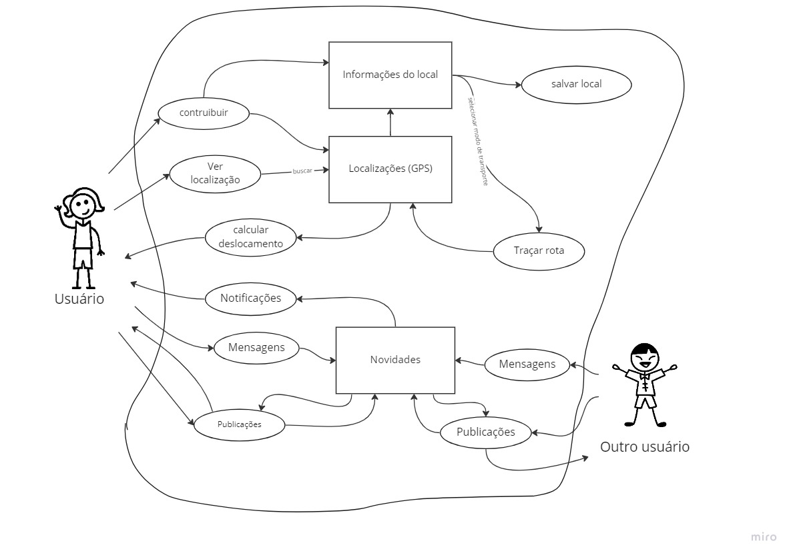
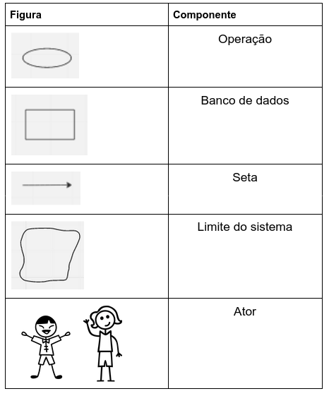

# Rich Picture

## 1. Introdução

&emsp;&emsp;O Rich Picture é uma forma de modelagem considerada informal, que possui uma notação que faz com que seja possível a análise de problemas e desenvolver ideias. Suas principais vantagens são: identificação de processos de negócios, atores e suas responsabilidades nesses processos.

## 2. Aplicativo escolhido

&emsp;&emsp;Para realizar a escolha de um aplicativo a ser utilizado no decorrer da disciplina, foram feitas análises de 6 aplicativos diferentes, encontrados na página de [Apps Analisados](./Apps Analisados.md), a fim de selecionar o que mais poderia se encaixar com a atividade proposta da disciplina. Para realizar a escolha tomamos como critérios os seguinte pontos:

* Público-Alvo: focamos em escolher o que fosse melhor para consultar o público usuário do aplicativo
* Rastreabilidade: buscamos entender se o aplicativo possui informações de fácil acesso sobre sua origem
* Documentação do projeto: buscamos um que tivesse a possibilidade da equipe poder coletar novos requisitos além dos já elencados

&emsp;&emsp;Levando em consideração todos esses pontos, a equipe entrou em acordo inicialmente de que a melhor opção poderia ser a Carteira Digital de Trânsito, em que há um público de maior facilidade para auxiliar no desenvolvimento do projeto, não tem todos os requisitos bem definidos e conseguimos identificar a sua origem. Porém, como já foi realizado um trabalho com este aplicativo, a equipe decidiu que seria melhor escolher outro, para que pudesse ser feito um trabalho mais completo e que pudesse ser utilizado como base para futuros trabalhos. O aplicativo escolhido foi o Google Maps, principalmente por ter funções bem definidas e permitir a engenharia reversa para a coleta de requisitos.

&emsp;&emsp;A figura 1 apresenta o Rich Picture desenvolvido para o aplicativo, baseado nas funcionalidades encontradas durante a utilização do app e discussão dos membros.

<figure markdown >
  <figcaption>Figura 1 - Rich Picture Google Maps</figcaption>

  <figcaption>Fonte: Alexia e  Lucas Felipe</figcaption>
</figure>

&emsp;&emsp;Na Figura 2 é possível verificar a legenda do Rich Picture desenvolvido:

<figure markdown >
  <figcaption>Figura 2 - Legenda do Rich Picture</figcaption>

  <figcaption>Fonte: Luíza Esteves</figcaption>
</figure>

## 3. Histórico de Versões

|    Data    | Versão |                          Modificações                           | Autor(es) |  Revisor(es)  |
| :--------: | :----: | :-------------------------------------------------------------: | :-------: | :-----------: |
| 08/11/2022 |  1.0   |                Criação da página de Rich Picture                |   Luíza   |    Marcus     |
| 10/11/2022 |  2.0   |                Alteração do aplicativo escolhido                |   Luíza   | Marcus e Iago |
| 18/11/2022 |  3.0   |                  Inclui imagem do rich picture                  |  Alexia   |     Iago      |
| 29/11/2022 |  3.1   | Padronização das legendas/fontes e texto descritivo das figuras |  Luciano  |     Iago      |

## 4. Bibliografia

Introducing Rich Pictures, CTEC2402 - Software Development Project. Acesso em nov. de 2022.
