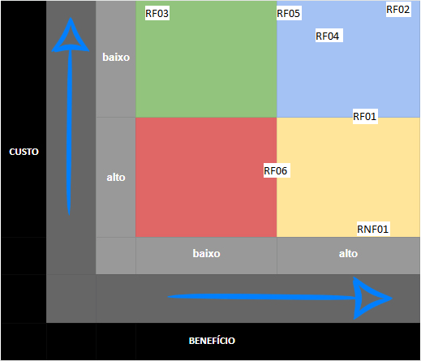

# Priorização

## 1. Introdução

&emsp;&emsp; A priorização é uma técnica de elicitação de requisitos que consiste em ordenar os requisitos de acordo com a importância que eles possuem para o usuário. Essa técnica é utilizada para que os requisitos mais importantes sejam implementados primeiro, e assim, o usuário possa utilizar o sistema com mais facilidade e rapidez.

## 2. Priorização

&emsp;&emsp; A priorização foi realizada através de três técnicas: MoSCoW, Custo x Benefício e BASICO. A seguir, serão apresentadas as técnicas utilizadas e os requisitos priorizados. Os requisitos utilizados são especificados na seção #4 página de [Entrevistas](5.entrevista.md).

### 2.1 BASICO

&emsp;&emsp; A técnica BASICO consiste em atribuir uma pontuação para cada requisito, de acordo com a sua importância, através de fatores elencados mais especificamente na página das [técnicas](técnicas%20de%20priorização/BASICO.md). Os requisitos A pontuação é dada de acordo com a tabela abaixo:

<figcaption align="center">Tabela 1: Requisitos em BASICO</figcaption>

| Requisito | B   | A   | S   | I   | C   | O   | Total |
| :-------- | :-- | :-- | :-- | :-- | :-- | :-- | :---- |
| RF01      | 5   | 2   | 5   | 3   | 5   | 2   | 22    |
| RF02      | 5   | 4   | 5   | 1   | 1   | 4   | 20    |
| RF03      | 1   | 5   | 5   | 1   | 4   | 1   | 17    |
| RF04      | 5   | 2   | 5   | 2   | 5   | 4   | 23    |
| RF05      | 3   | 3   | 3   | 1   | 5   | 5   | 20    |
| RF06      | 2   | 5   | 5   | 5   | 5   | 1   | 23    |
| RNF01     | 5   | 5   | 4   | 5   | 5   | 3   | 27    |

<figcaption align="center">Fonte: Elaboração própria</figcaption>

&emsp;&emsp; Após a pontuação, os requisitos foram ordenados de acordo com a pontuação total, sendo o requisito com maior pontuação o mais importante. A sequência de priorização dos requisitos é apresentada da seguinte maneira.

<figcaption align="center">Tabela 2: Requisitos em BASICO priorizados </figcaption>

| Ordem de prioridade |  Requisito  |
| :-----------------: | :---------: |
|          1          |    RNF01    |
|          2          | RF04 e RF06 |
|          3          |    RF01     |
|          4          | RF02 e RF05 |
|          5          |    RF03     |

<figcaption align="center">Fonte: Elaboração própria </figcaption>

&emsp;&emsp; O link para o vídeo da aplicação da técnica BASICO pode ser acessado [aqui](https://youtu.be/Pq_891Akk_Y).

### 2.2 Custo x Benefício

&emsp;&emsp; A técnica Custo x Benefício consiste em apenas pegar os dados previstos para o seu projeto e encaixá-los nos quadrantes coloridos, melhor especificado na página de [técnicas](técnicas%20de%20priorização/Custo%20x%20Beneficio.md). Os requisitos foram colocados em cada quadrante de acordo com a sua importância e o seu custo. A tabela abaixo apresenta os requisitos em cada quadrante:

<figcaption align="center">Imagem 1: Requisitos em Custo x Benefício</figcaption>

<figcaption align="center">Fonte: Elaboração própria</figcaption>

&emsp;&emsp; O link para o vídeo da aplicação da técnica Custo x Benefício pode ser acessado [aqui](https://youtu.be/wPYxSMKpp8o).

### 2.3 MoSCoW

&emsp;&emsp; MoSCoW, que consiste em dividir os requisitos em quatro categorias: "Must", "Should", "Could" e "Won't". Essas categorias são definidas de acordo com a importância que o requisito possui para o usuário. Os requisitos que são considerados essenciais para o sistema são classificados como "Must", os requisitos que são importantes, mas não essenciais, são classificados como "Should", os requisitos que são desejáveis, mas não essenciais, são classificados como "Could" e os requisitos que não são desejáveis, são classificados como "Won't". Nos tópicos a seguir, serão elencadas as personas que foram entrevistadas e os requisitos que foram priorizados para cada uma delas.

#### 2.3.1 Cronograma de entrevistas

<figcaption align="center">Tabela 3: Cronograma de entrevistas</figcaption>

| Data       | Hora  | Persona entrevistada | Entrevistador |
| ---------- | ----- | -------------------- | ------------- |
| 30/11/2022 | 17:35 | Manoel Gomes         | Marcus        |
| 30/11/2022 | 17:55 | Juliana Almeida      | Iago          |
| 30/11/2022 | 18:15 | Carolina Silveira    | Marcus        |
| 30/11/2022 | 18:30 | Ricardo Mendes       | Iago          |

<figcaption align="center">Fonte: Elaboração própria </figcaption>

#### 2.3.2 Manuel Gomes (persona primária)

<figcaption align="center">Tabela 3: Requisitos priorizados com Manoel em MOSCoW </figcaption>

| MOSCoW |     Requisito     |
| :----: | :---------------: |
|  Must  | RF01, RF04, RNF01 |
| Should |    RF05, RF06     |
| Could  |       RF02        |
| Won't  |       RF03        |

<figcaption align="center">Fonte: Elaboração própria </figcaption>

&emsp;&emsp; O link para o vídeo da aplicação da técnica MoSCoW com o Manuel Gomes pode ser acessado [aqui](https://youtu.be/cihl-itrQKk).

#### 2.3.3 Juliana Almeida (anti-persona)

<figcaption align="center">Tabela 4: Requisitos priorizados com Juliana em MOSCoW </figcaption>

| MOSCoW |     Requisito     |
| :----: | :---------------: |
|  Must  | RF02, RF05, RNF01 |
| Should |       RF01        |
| Could  |       RF06        |
| Won't  |    RF03, RF04     |

<figcaption align="center">Fonte: Elaboração própria </figcaption>

&emsp;&emsp; O link para o vídeo da aplicação da técnica MoSCoW com a Juliana Almeida pode ser acessado [aqui](https://youtu.be/8MzfqGi_kCk).

#### 2.3.4 Carolina Silveira (persona secundária)

<figcaption align="center">Tabela 5: Requisitos priorizados com Carolina em MOSCoW </figcaption>

| MOSCoW |    Requisito     |
| :----: | :--------------: |
|  Must  | RF01, RF02, RF04 |
| Should |    RF05, RF06    |
| Could  |                  |
| Won't  |   RF03, RNF01    |

<figcaption align="center">Fonte: Elaboração própria </figcaption>

&emsp;&emsp; O link para o vídeo da aplicação da técnica MoSCoW com a Carolina Silveira pode ser acessado [aqui](https://youtu.be/A-rQizDWEFw).

#### 2.3.5 Ricardo Mendes (persona secundária)

<figcaption align="center">Tabela 6: Requisitos priorizados com Ricardo em MOSCoW </figcaption>

| MOSCoW |    Requisito     |
| :----: | :--------------: |
|  Must  | RF01, RF02, RF05 |
| Should |       RF06       |
| Could  |       RF04       |
| Won't  |   RF03, RNF01    |

<figcaption align="center">Fonte: Elaboração própria </figcaption>

&emsp;&emsp; O link para o vídeo da aplicação da técnica MoSCoW com o Ricardo Mendes pode ser acessado [aqui](https://youtu.be/RB4gYeuXv3c).

## 3. Conclusão

&emsp;&emsp;De acordo com as técnicas de priorização utilizadas, os requisitos mais importantes para o sistema são apresentados nessa sequência: RNF01, RF01, RF02, RF04, RF06, RF05, RF03. Esses requisitos foram priorizados de acordo com a importância que eles possuem para o usuário, sendo que os requisitos que possuem maior pontuação são os mais importantes.

## 4. Histórico de Versões

| Data       | Versão | Modificações                                | Autor(es)     | Revisor(es) |
| ---------- | ------ | ------------------------------------------- | ------------- | ----------- |
| 30/11/2022 | 1.0    | Criação da Página e Requisitos Priorizados  | Iago e Marcus | Lucas       |
| 30/11/2022 | 1.1    | Adição de Vídeos de Aplicação               | Iago e Marcus | Lucas       |
| 06/12/2022 | 2.0    | Adição das tabelas de priorização           | Marcus        | Lucas       |
| 06/12/2022 | 2.1    | Adição dos Motivos da escolhas das técnicas | Marcus        | Lucas       |
