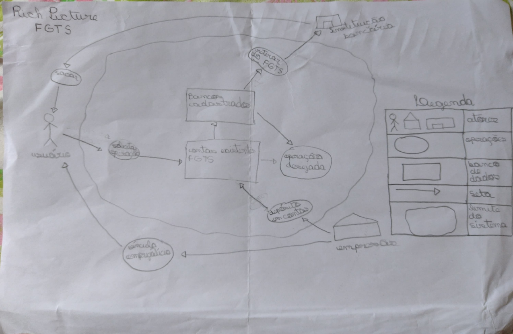

# Aplicativos analisados

## Introdução

Em uma atividade inicial passada pelo professor André Barros, cada integrante da equipe desenvolveu a modelagem de um Rich Picture para que pudessem ser feitas a análise e chegar a uma escolha para desenvolver pelo grupo. Essa área irá mostrar o que foi realizado por cada integrante.

## Rich Pictures desenvolvidos pela equipe

### 1. Sinesp Cidadão
O Sinesp Cidadão é um aplicativo desenvolvido para o Sistema Nacional de Informações de Segurança Pública (Sinesp), permitindo aos brasileiros o acesso a serviços da Secretaria Nacional de Segurança Pública. A Figura 1 mostra o desenvolvimento do Rich Picture do aplicativo:

<figure markdown >
  <figcaption>Figura 1 - Rich Picture Sinesp Cidadão</figcaption>
</figure>

### 2. CNH Online
A CNH Online é um aplicativo que permite o usuário a acessar a sua habilitação digitalmente, além de verificar infrações, veículos em seu nome e tirar dúvidas. A Figura 2 mostra o desenvolvimento do Rich Picture do aplicativo:

<figure markdown>
  <figcaption>Figura 2 - Rich Picture CNH Online</figcaption>
</figure>

### 3. FGTS

O FGTS permite aos trabalhadores consultar saldo total das contas, depósitos realizados pelo empregador, impressão de extratos entre várias outras funções. A Figura 3 mostra o desenvolvimento do Rich Picture do aplicativo:

<figure markdown >
  <figcaption>Figura 3 - Rich Picture FGTS</figcaption>
</figure>

### 4. Receita Federal
O aplicativo da Receita Federal oferece um status geral do CPF em vários sistemas da Receita Federal, quando for acessado com conta gov.br. A Figura 4 mostra o desenvolvimento do Rich Picture do aplicativo:

### 5. CadÚnico
O aplicativo Cadastro Único é um canal de atendimento para Programas Sociais do Governo Federal.
### 6. UnB Hub

## Histórico de Versões

| Data | Versão | Descrição | Autor |
| :--: | :----: | :-------: | :---: |
| 08/11/2022 | 0.1 | Criação da página | Luíza |

## Referências Bibliográficas

[Cinesp](https://play.google.com/store/apps/details?id=br.gov.sinesp.cidadao.android&hl=pt_BR&gl=US&pli=1)

[CNH Online](https://www.detran.mg.gov.br/habilitacao/emissao-de-documentos-de-habilitacao/cnh-digital-1)

[FGTS](https://play.google.com/store/apps/details?id=br.gov.caixa.fgts.trabalhador&hl=pt_BR&gl=US)

[Receita Federal](https://play.google.com/store/apps/details?id=br.gov.economia.receita.rfb&hl=pt_BR&gl=US)

[CadUnico](https://play.google.com/store/apps/details?id=br.gov.dataprev.meucadunico&hl=pt_BR&gl=US)